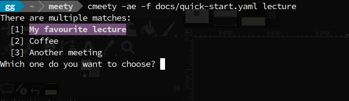

# Meety - quickly start online meetings from YAML

**Problem.**
Online meetings provide a useful means to communicate with others. With an increasing number of meetings, however, it can get difficult to remember or pick the right meeting location, user id, password and so on.

**Goal.**
_Meety_ aims to provide a quick and easy way to start the right online meeting from a list of predefined meetings. Meetings are defined in YAML, a clean and simple format that is well readable for humans and machines alike. Thus, you can

- view and edit the meetings with your favourite text editor and
- sensibly share them with other users, even if they don't use _Meety_.
  (Think of conferences, lectures, ...)
  
**Features.**
_Meety_ can can load meetings from one or multiple YAML files. The meetings can be filtered by time preferences and/or keywords. After choosing a meeting, _Meety_ will try to connect to it based on the information the meeting provides. 

Out of the box, _Meety_ supports meetings via the browser and via the _Zoom_ app. However, the application can easily be configured to handle other types of meetings too, as described in the [documentation](./docs/configuration.md#supported-connections).




_Meety_ ships with a graphical user interface (program `meety`, first screenshot above) and with a command line interface (program `cmeety`, second screenshot above).


## Quick start

Just follow the three steps below.

### Step 1/3: Install _Meety_

- **Preferred: If you have Python and PIP installed,** 
  simply run one of the following commands in your shell:
	- user only: `pip3 install --user meety`
	- system-wide: `sudo pip3 install meety`
  You may have to take care that the path to the installation directory known to your system.
  
  If the application doesn't run as expected, please consider updating the required packages via the _requirements.txt_ file in this repository: `pip install --upgrade -r requirements.txt`
- **Alternatively download one of the bundles:**
    - Linux
		- [Debian package](https://github.com/GaetanoGeck/meety/releases/download/v0.10.0/python3-meety_0.10.0-1_all.deb) (Ubuntu, ...):
		- [RPM package](https://github.com/GaetanoGeck/meety/releases/download/v0.10.0/meety-0.10.0-1.noarch.rpm) (Fedora, openSUSE, ...):
    - MacOS: Right now, there is unfortunately no alternative.
    - Windows
		1. Install the runtime library from Microsoft: [Visual C++ 2010 Redistributable Package (x86)](https://www.microsoft.com/en-US/download/details.aspx?id=5555)
		2. Download the [zip archive](https://github.com/GaetanoGeck/meety/releases/download/v0.10.0/meety-0.10.0-windows.zip) that contains
            - the graphical user interface (`meety.exe`) and
            - the required libraries.
        3. Extract the archive into a suitable place (e.g. to `C:\Program Files\meety`).
           Maybe create a shortcut to `meety.exe` (right click on the program and then select "Send to Desktop").

**Shortcuts.** For convenient use of the graphical user interface, you might want to create shortcuts on your desktop and/or menu.
- run `meety`
- click on "info" in the bottom right corner
- switch tab "System" and click on "create"

_Note:_ For technical reasons, this is currently not guaranteed to work in all environments. In particular, it does not work for the Windows bundle. Sorry!

### Step 2/3: Add a meetings file

Add a YAML file with meeting specifications to your home directory. You may find it helpful to **start with a template:** you may, for instance,
- **GUI:** run `meety` and, if no meetings are found, click on the button "Create specification from template"
  (this button can also be found in the "info" dialog, on tab "Files")
- **CLI:**
    - copy the contents of [template](./docs/quick-start.yaml), also shown below,
    - or run `cmeety --init` from the command-line, to create a file named `meetings.yaml` in your home directory.

<details>
<summary>Notes on filenames and directories</summary>

- With the default options, the filename is of no importance as long it has extension `.yaml` or `.yml`.
- The home directory is system-specific
	- `/home/<username>/` on Linux,
	- `/Users/<username>/` on MacOS and
	- `C:\Users\<username>\` on Windows.
- _Meety_ can also load files from other directories than your home directory (and can also ignore those in your home directory). For instance, you can load meetings from file `~/meetings/conferenceA.yaml` only by invoking _Meety_ with arguments `-e -f ~/meetings/conferenceA.yaml`. This is described in more detail in the [documentation](./docs/select-files.md).

</details>

**Example template**
```text
# Example meeting specifications in YAML
# Text after '#' is ignored by the application

# FIRST MEETING (Coffee round with colleagues, every morning)
- name: Coffee
  zoom-url: https://zoom.us/j/123456789
  prefer: Monday to Friday, 9 to 10 o'clock
  # short format for time specifications (also for other languages)

# SECOND MEETING (lecture, each Tuesday and Thursday)
- name: My favourite lecture
  url: https://my-university.edu/my-fav-lecture
  prefer:
    - weekday: Tuesday
      time: 12:00 - 14:00
      date: 2020-10-01 - 2021-03-31
    - weekday: Thursday
      time: 14:00 - 16:00
      date: 2020-10-01 - 2021-03-31
  # explicit format for time specifications (also for other languages)

# THIRD MEETING (without time preferences)
- name: Another meeting
  zoom-id: 987-654-321
```

<details>
<summary>Some specification details</summary>

**Syntax overview for meeting specifications.**
Each meeting forms a list entry that is introduced with a dash, `-`. Such an entry is expected to be a dictionary, which can comprise several attributes of the form `key: value`. _Meety_ ignores the case of characters in the key. Values in turn can be text, a list or a dictionary again. To be recognised as a meeting specification, each entry is required to have an attribute with key `name`. This attribute has to be provided explicitly or can be derived automatically from other attributes. Other attributes are optional but may affect querying if they have a text value. More importantly, attributes with some keys, like `url`, `zoom-url` and `prefer` have a special meaning for _Meety_.

**Connection attributes.**
As an example, _Meety_ can establish connections from values for attributes with keys `url`, `zoom-url`, or `zoom-id`.
It is possible to customise the default connection handlers or register your own ones. You can also ask _Meety_ to infer attributes automatically from existing ones. For instance, if you provide attribute `zoom-id: 123-456-789` but no attribute with key `zoom-url`, then _Meety_ will add `zoom-url: https://zoom.us/j/123456789` (internally, not to the YAML file).
This is described in more detail in the [documentation](./docs/configuration.md#supported-connections).

**Support for other languages.**
Inferred attributes can also be used to make other words understood by _Meety_, in particular words from other languages. _Meety_ currently ships with some English, French, German, Italian and Spanish definitions (which can be enabled or disabled via the configuration), see the [documentation](./docs/configuration.md#languages) for more information.
</details>

### Step 3/3: Run _Meety_

The goal of _Meety_ is to help you to connect to the meeting you're looking for quickly and effortlessly.
First, you have to identify a meeting of course. Then, you can try to connect to it.

**General notes.**
_Meety_ rates all meetings and shows meetings sorted by their rating (the best matching first). Meetings with equal ratings are shown in the order they have been loaded. Depending on your options, _Meety_ shows all or only matching meetings.

Meetings can be matching with respect to
- their time preferences and
- keywords, if provided.

Matching keywords contribute more to the rating than matching time preferences by default.

**Application usage.**
Although the idea of meeting ratings and display is the same, usage natuarlly varies with the user interface. Each interface is described on its own:
- [Graphical user interface](./docs/gui.md) (program `meety`)
- [Command-line interface](./docs/cli.md) (program `cmeety`)


## Detailed documentation

In the [docs](./docs) directory, you can find more information on _Meety_. In particular on the following topics:

- [How to specify meetings in YAML](./docs/specify-meetings.md);
- [Select meeting files to load from](./docs/select-files.md);
- [Configure _Meety_](./docs/configuration.md), in particular how to
    - [support other languages](./docs/configuration.md#languages),
    - [change the colour scheme](./docs/configuration.md#colour-schemes)
    - [set default arguments](./docs/configuration.md#default-arguments)
    - [automatically polish meeting data](./docs/configuration.md#meeting-data)
    - [support new connection types](./docs/configuration.md#connections)
