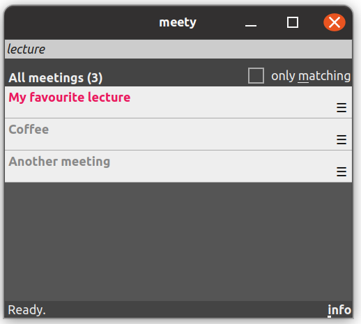
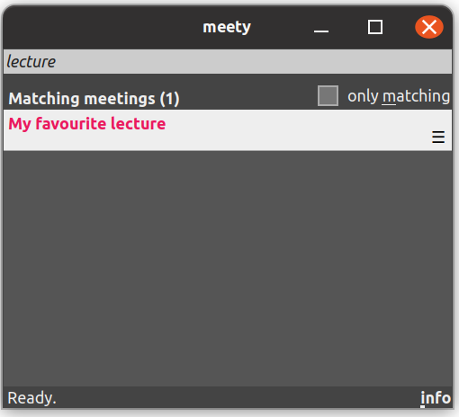

# Graphical user interface

After starting _Meety_, the graphical user interface shows meetings according to their rating. Matching entries are highlighted, [according to the active colour scheme](https://github.com/GaetanoGeck/meety/blob/main/docs/configuration.md#colour-schemes).

## Searching

As an example, for those meetings defined in the [template meeting specification](./docs/quick-start.yaml), the app should look as follows after entering "lecture" in the search field at the top.

**Show only matching meetings.**
If you change the text in the search field or as time passes, the rating is updated, which may affect the order of items. By default, _all_ meetings are shown. If you activate the checkbox _only matching_, non-matching meetings are hidden.

## Selecting a meeting

You can select a meeting by (left) clicking on it or by use of the arrow keys <kbd>Up</kbd> and <kbd>Down</kbd>.

## Start a meeting

You can start a meeting with the _preferred_ connection handler by
- clicking or double-clicking on an item (depending on your system)
- or by selecting an item and pressing <kbd>Enter</kbd>.

Note that _other_ connection handlers than the _preferred_ one (if existing) can be chosen via the context menu.

**All actions in the context menu:**
- Copy the meeting data
    - either as specified in the YAML file
    - or as used by _Meety_ internally (possibly cleaned and extended)
- Select a specific connection handler,
  useful if there are multiple candidates (Web, Zoom etc.)
- Ask _Meety_ to reload the YAML files
- Ask _Meety_ to add a meeting specification (not in the screenshot)

The context menu can be opened by a right click on the entry or a normal click on the "☰" symbol in the bottom right of the entry.

## Copying and dragging a meeting

**Dragging.** In case you want to share information on a selected meeting quickly with somebody else, you can drag a meeting to a text field. Note that there are two modes affecting the content:
- minimalistic (by default), which yields a single line of the form `<NAME>: <PREFERRED CONNECTION HANDLER URL>` and
- more informative (if <kbd>Shift</kbd> is pressed), which yields the YAML entry.

**Keyboard.** Alternatively, you can press the "copy sequence" on your system (probably <kbd>Ctrl+C</kbd>) once, for the minimalistic content, and twice within a short delay, for the more informative content.

## Adding and dropping a meeting

You can also add meeting specifications by dragging texts or URLs from some other place and dropping them onto the application. On such a drop, a dialog opens that let's you choose whether the specification should be added only to the running instance of _Meety_ (such that it will be lost if you close the application) or to some YAML file. In the latter case, the specification will be simply appended to the file. That is, if the file previously contained meeting specifications, they'll remain unchanged.

This dialog can also be reached via the entry `Add meeting` in the context menu.

## Info dialog

Additional information and actions can be accessed via the info dialog (click on "info" in the bottom right corner of the application). In particular, the various tabs in this dialog allow you to
- create shortcuts to application `meety`
- list all the directories and YAML files that have been loaded
- a textual overview of all present meeting entries
- a log of errors, warnings and more detailed information

